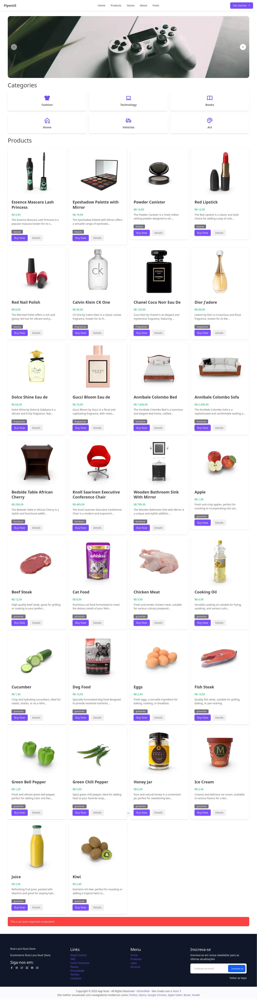
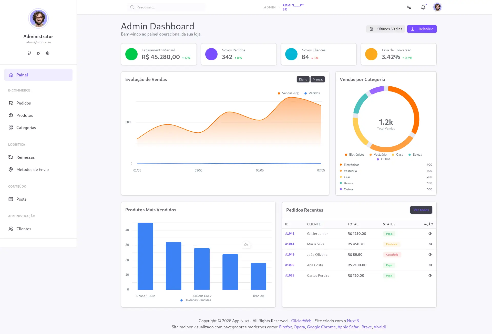

# App Loco Framework Web Rust with Nuxt

## Full-Stack E-Commerce Platform built with Rust Lang and Nuxt.js

A production-ready e-commerce application featuring a high-performance REST API built with [Loco.rs](https://loco.rs/) (Rust) and a modern, responsive storefront powered by [Nuxt.js](https://nuxt.com/) (Vue.js). Loco.rs is like [Ruby on Rails](https://rubyonrails.org/), but for [Rust Lang](https://www.rust-lang.org/).

 




---

## ✨ Key Features

- **Full E-Commerce Flow** - Products, categories, cart, checkout, orders, payments, shipping, coupons, reviews, wishlists
- **JWT Authentication** - Register, login, email verification, password reset, magic link (passwordless)
- **Admin Dashboard** - Complete back-office with stats, CRUD management for all entities
- **API Documentation** - OpenAPI/Swagger UI available at `/api/docs`
- **Internationalization** - Multi-language support (pt-BR, en, es)
- **PWA Ready** - Progressive Web App with offline caching via Workbox
- **SEO Optimized** - SSR, meta tags, sitemap, Open Graph tags
- **Fully Tested** - Backend unit/integration tests (89 tests), frontend component tests (Vitest), E2E tests (Playwright)

## 🛠 Tech Stack

| Layer | Technology |
|---|---|
| **Backend** | [Rust Lang](https://www.rust-lang.org/) • [Loco.rs 0.15](https://loco.rs/) • [Axum 0.8](https://github.com/tokio-rs/axum) • [SeaORM 1.1](https://www.sea-ql.org/SeaORM/) |
| **Database** | [PostgreSQL 16](https://www.postgresql.org/) |
| **Frontend** | [Nuxt 4](https://nuxt.com/) • [Vue 3.5](https://vuejs.org/) • [Pinia 3](https://pinia.vuejs.org/) • [Vue Router 5](https://router.vuejs.org/) |
| **UI** | [Tailwind CSS v4](https://tailwindcss.com/) • [FlyonUI 2](https://flyonui.com/) • [shadcn-vue](https://www.shadcn-vue.com/) |
| **Auth** | JWT • Argon2id • Magic Link |
| **Validation** | [VeeValidate](https://vee-validate.logaretm.com/) (frontend) • [validator](https://crates.io/crates/validator) (backend) |
| **API Docs** | [utoipa](https://crates.io/crates/utoipa) + [Swagger UI](https://swagger.io/tools/swagger-ui/) |
| **Testing** | Cargo Test (89 tests) • [Vitest](https://vitest.dev/) • [Playwright](https://playwright.dev/) |
| **Icons** | [Lucide](https://lucide.dev/) • [Tabler](https://tabler.io/icons) |
| **Container** | [Docker](https://www.docker.com/) • Docker Compose |
| **PWA** | [@vite-pwa/nuxt](https://vite-pwa-org.netlify.app/frameworks/nuxt) |
| **i18n** | [@nuxtjs/i18n](https://i18n.nuxtjs.org/) (pt-BR, en, es) |

## Demo App

https://app-nuxt-store.pages.dev/

## Admin App
https://app-nuxt-store.pages.dev/admin/

admin: admin@example.com

manager: manager@example.com

editor: editor@example.com

support: support@example.com

customer: customer@example.com

viewer: viewer@example.com

Everyone's password: Password123!

## 📂 Project Structure

```
app-rust-nuxt-store/
├── api_rust_loco/          # Rust backend (Loco.rs REST API)
│   ├── src/
│   │   ├── controllers/    # 16 API controllers
│   │   ├── models/         # SeaORM entities + business logic
│   │   ├── views/          # Response serialization
│   │   ├── mailers/        # Email templates (welcome, reset, magic-link)
│   │   ├── workers/        # Background jobs
│   │   ├── seeds/          # Database seeders
│   │   ├── openapi.rs      # OpenAPI/Swagger configuration
│   │   └── app.rs          # App hooks + route registration
│   ├── config/             # Environment configs (dev, test, prod)
│   ├── migration/          # SeaORM database migrations
│   └── tests/              # 89 unit + integration tests
├── app-nuxt/               # Nuxt 4 frontend (Vue.js storefront)
│   ├── app/
│   │   ├── components/     # Reusable UI components
│   │   ├── composables/    # Vue composables (useAuth, useCartUI, useWishlist)
│   │   ├── layouts/        # Page layouts (default, auth, admin)
│   │   ├── middleware/      # Route guards (auth, admin)
│   │   ├── pages/          # File-based routing (15+ page groups)
│   │   ├── plugins/        # Nuxt plugins (auth, flyonui, veevalidate)
│   │   └── stores/         # Pinia stores (cart, users)
│   ├── tests/
│   │   ├── unit/           # Vitest component tests
│   │   └── e2e/            # Playwright E2E tests
│   └── locales/            # i18n translations (pt-BR, en, es)
├── docs/                   # Project documentation
└── docker-compose.yml      # Container orchestration
```

## 🚀 Getting Started

### Prerequisites

- [Rust](https://www.rust-lang.org/tools/install) (latest stable)
- [Node.js 20+](https://nodejs.org/) with [pnpm](https://pnpm.io/)
- [PostgreSQL 16](https://www.postgresql.org/download/)
- [Docker](https://www.docker.com/) (optional)

### Run Backend (Loco.rs API)

```shell
cd api_rust_loco/

DATABASE_URL="change-me"
CORS_ALLOWED_ORIGIN="change-me"
# Required for direct backend access protection (Nuxt proxy will send it)
# openssl rand -base64 32 or openssl rand -base64 64
API_PROTECTION_API_KEY="change-me"
API_RATE_LIMIT_ENABLED="true"
API_RATE_LIMIT_IP_REQUESTS="120"
API_RATE_LIMIT_IP_WINDOW_SECONDS="60"
API_RATE_LIMIT_USER_REQUESTS="300"
API_RATE_LIMIT_USER_WINDOW_SECONDS="60"
# openssl rand -base64 32 or openssl rand -base64 64
AUTH_JWT_SECRET="change-me"

# Create database and run migrations
cargo loco db create
cargo loco db migrate
cargo loco db seed    # Seed with sample data
cargo loco db reset

# Start the API server
cargo loco start
# API running at http://localhost:5150
# Swagger UI at http://localhost:5150/api/docs (requires x-api-key on direct backend access)
```

### Run Frontend (Nuxt)

```shell
cd app-nuxt/
NUXT_API_RUST_BASE_URL="change-me"
# openssl rand -base64 32 or openssl rand -hex 32
NUXT_API_RUST_API_KEY="change-me"
# to generate only 32 chars openssl rand -base64 24 | cut -c1-32, openssl rand -hex 16, openssl rand -base64 22, openssl rand -base64 24 | head -c 32
NUXT_CSRF_ENCRYPT_SECRET="change-me"

pnpm install
pnpm dev --open
# Frontend running at http://localhost:3000
```

### Run with Docker

```shell
docker-compose build
docker-compose up
# API: http://localhost:5150
# Frontend: http://localhost:3000

# Run migrations inside container
docker-compose run --rm app cargo loco db migrate
docker-compose run --rm app cargo loco db seed
```

### Run Tests

```shell
# Backend tests (89 tests)
cd api_rust_loco/
cargo test

# Frontend component tests
cd app-nuxt/
pnpm run test:unit

# Frontend E2E tests
cd app-nuxt/
pnpm run test:e2e
```

## 📋 API Endpoints

All routes are prefixed with `/api/` and return JSON. Full Swagger documentation available at `/api/docs`.

Large list endpoints accept `page` and `per_page` query parameters and use SeaORM pagination internally. The default is `page=1&per_page=20`, with a maximum `per_page` of `100`.

Read-heavy catalog/content endpoints use short-lived in-memory caches, product and variant reads use single-query joins on cold cache, and production keeps database pool connections warm by default (`DB_IDLE_TIMEOUT=300000`, `DB_MIN_CONNECTIONS=5`, `DB_MAX_CONNECTIONS=20`) to avoid cold reconnect latency during normal navigation.

| Module | Prefix | Endpoints | Auth |
|---|---|---|---|
| **Auth** | `/api/auth/` | register, verify, login, forgot, reset, current, magic-link | Mixed |
| **Products** | `/api/products/` | CRUD + image upload + category relations | JWT (write) |
| **Categories** | `/api/categories/` | CRUD + hierarchy + relations | JWT (write) |
| **Cart** | `/api/carts/` | list, add_item, remove_item, update_item, clear | JWT |
| **Orders** | `/api/orders/` | list, get_one | JWT |
| **Payments** | `/api/payments/` | list, add, get_one, update | JWT |
| **Addresses** | `/api/addresses/` | list, add, update, remove | JWT |
| **Shipping** | `/api/shippings/` | list, add, update, remove | JWT |
| **Coupons** | `/api/coupons/` | list, add, get_one, update, remove | JWT |
| **Reviews** | `/api/reviews/` | list, add, update, remove | JWT |
| **Wishlists** | `/api/wishlists/` | list, add, remove | JWT |
| **Variants** | `/api/variants/` | CRUD | JWT (write) |
| **Posts** | `/api/posts/` | CRUD | JWT (write) |
| **Profiles** | `/api/profiles/` | CRUD | JWT (write) |

## 📊 Database Entities (19 tables)

| Entity | Description | Status |
|---|---|---|
| `users` | User accounts with JWT auth | ✅ Done |
| `profiles` | User profile details | ✅ Done |
| `posts` | Blog/content posts with status workflow | ✅ Done |
| `categories` | Product categories with hierarchy (self-referencing) | ✅ Done |
| `products` | Product catalog with pricing and metadata | ✅ Done |
| `product_images` | Product gallery images | ✅ Done |
| `product_variants` | Size/color/material product variants | ✅ Done |
| `variant_options` | Option types (e.g., Color, Size) | ✅ Done |
| `product_variant_options` | Variant-option mapping | ✅ Done |
| `carts` | Shopping cart sessions | ✅ Done |
| `cart_items` | Cart line items | ✅ Done |
| `orders` | Customer orders | ✅ Done |
| `order_items` | Order line items | ✅ Done |
| `payment_methods` | Payment gateway configurations | ✅ Done |
| `payments` | Payment transactions | ✅ Done |
| `addresses` | Customer addresses (billing/shipping) | ✅ Done |
| `shipping_methods` | Shipping carriers and methods | ✅ Done |
| `shipments` | Package tracking | ✅ Done |
| `coupons` | Discount coupon codes | ✅ Done |
| `coupon_usages` | Coupon redemption tracking | ✅ Done |
| `reviews` | Product reviews and ratings | ✅ Done |
| `wishlists` | User wishlists | ✅ Done |

## 🎨 Frontend Pages

### Public Pages
- **Home** - Hero banner carousel, featured categories, product grid
- **Products** - Product listing with filters and pagination
- **Product Detail** - Gallery, pricing, variants, reviews, add to cart
- **Categories** - Category listing and detail pages with product grids
- **Posts** - Blog-style content listing and detail
- **Cart** - Shopping cart with quantity management
- **Checkout** - Multi-step checkout flow
- **Wishlist** - Saved products
- **Static Pages** - About, Contact, Privacy, Terms, Stores

### Admin Panel
- **Dashboard** - Statistics cards (orders, revenue, traffic, signups, retention)
- **Products** - Full CRUD with image upload and drag-drop
- **Categories** - Full CRUD with hierarchy management
- **Orders** - Order management and status tracking
- **Posts** - Content management
- **Profiles** - User profile management
- **Reviews** - Review moderation
- **Coupons** - Coupon management
- **Addresses** - Address management
- **Shipments** - Shipping and tracking management
- **Banners** - Banner management

---

## ✅ ToDo - Completed

* [X] Users (registration, JWT auth, email verification, password reset, magic link)
* [X] Profiles (CRUD, avatar, bio, phone, whatsapp)
* [X] Posts (CRUD, 8-state status workflow)
* [X] Categories (CRUD, hierarchical self-referencing tree)
* [X] Products (CRUD, multipart image upload, SKU, pricing)
* [X] Products Images (gallery, cover, position, alt text)
* [X] Products Variants (size, color, material with independent pricing)
* [X] Products Variants Images
* [X] Products Options (option types: Color, Size, etc.)
* [X] Products Variants Options (variant-option mapping)
* [X] Cart (session-based, Pinia + localStorage persistence)
* [X] Cart Items (add, remove, update quantity, clear)
* [X] Orders (status workflow: pending → confirmed → shipped → delivered)
* [X] Orders Items (product/variant references)
* [X] Payments Methods (configurable payment gateways)
* [X] Payments (transaction tracking, status management)
* [X] Addresses (billing/shipping, default flag)
* [X] Shipping Methods (carriers, pricing, free shipping threshold)
* [X] Shipments (tracking number, carrier, status timeline)
* [X] Coupons (percentage/fixed, min amount, max discount, expiry, usage limits)
* [X] Coupons Usages (per-user/per-order tracking)
* [X] Reviews (1-5 stars, verified purchase, moderation)
* [X] Wishlist (per user, toggle on product cards)
* [X] Admin Dashboard (stats: orders, revenue, traffic, signups, retention)
* [X] Admin CRUD (products, categories, orders, posts, profiles, reviews, coupons, addresses, shipments, shippings)
* [X] i18n (pt-BR, en, es)
* [X] SEO (SSR, meta tags, sitemap, Open Graph)
* [X] PWA (offline caching, Workbox)
* [X] OpenAPI/Swagger documentation (`/api/docs`)
* [X] Backend tests (89 unit + integration tests)
* [X] Frontend component tests (Vitest)
* [X] E2E tests (Playwright)
* [X] Docker + Docker Compose

## 📌 ToDo - Pending

### Core Commerce
* [ ] Payment gateway integration (Stripe, PayPal, Braintree, Mercado Pago, Pagar.me, Iugu, AbacatePay, Cielo, Getnet)
* [ ] Inventory management (stock tracking per product/variant)
* [ ] Low-stock alerts and automatic out-of-stock handling
* [ ] Order invoice generation (PDF)
* [ ] Refund and return management
* [ ] Tax calculation by region
* [ ] Multi-currency support with exchange rates
* [ ] Subscription products (recurring billing)
* [ ] Digital products (downloadable files, license keys)
* [ ] Gift cards and store credit
* [ ] Loyalty points / rewards program
* [ ] Product bundles and kits
* [ ] Research and select APIs for USA (e.g., UPS, FedEx, or USPS).
* [ ] Research and select APIs for Brazil (e.g., Correios, Melhor Envio, or Jadlog).
* [ ] Implement a conditional checkout logic based on the user's country.
* [ ] Map weight and dimension units (Metric vs. Imperial).
* [ ] Add currency support for shipping costs (USD, BRL and more).
* [ ] Set up error handling for unsupported zip codes.


### Search & Discovery
* [ ] Full-text product search (PostgreSQL tsvector or Meilisearch)
* [ ] Product filtering (price range, category, rating, availability)
* [ ] Product sorting (price, newest, best-selling, rating)
* [ ] Product recommendations ("Customers also bought", "Similar products")
* [ ] Recently viewed products
* [ ] Product comparison (side-by-side specs)
* [ ] Search autocomplete / suggestions
* [ ] Trending products / popular searches

### Infrastructure & Performance
* [ ] Redis cache layer (product listings, categories, sessions)
* [ ] S3-compatible image storage (AWS S3 / MinIO)
* [ ] CDN for static assets and images
* [ ] Cursor-based API pagination
* [ ] Database query optimization and indexing
* [ ] API response compression and caching (ETags)
* [ ] Background job queue (email sending, image processing)
* [ ] Health checks and readiness probes

### Customer Experience
* [ ] Customer account dashboard (order history, saved addresses, settings)
* [ ] Order status email notifications (confirmation, shipped, delivered)
* [ ] Abandoned cart recovery emails
* [ ] Back-in-stock notifications
* [ ] Social login (Google, Facebook, GitHub, Apple)
* [ ] Notification center (in-app alerts for orders, promotions)
* [ ] Product Q&A section
* [ ] Infinite scroll on product listings
* [ ] Dark mode toggle
* [ ] Breadcrumb navigation

### Integrations & APIs
* [ ] Webhook system (order events, payment events)
* [ ] GraphQL API (alternative to REST)
* [ ] Real-time notifications (WebSocket / SSE)
* [ ] Shipping carrier API integration (tracking, rates)
* [ ] Email marketing integration (Mailchimp, SendGrid)
* [ ] Analytics integration (Google Analytics, Plausible)
* [ ] Chat support (LiveChat / Tawk.to)

### Admin & Analytics
* [ ] Advanced analytics dashboard (conversion funnels, CLV, revenue by category)
* [ ] Customer segmentation (VIP, new, inactive)
* [ ] Bulk import/export (CSV/Excel for products, categories, customers)
* [ ] A/B testing framework
* [ ] Audit log (admin action tracking)
* [ ] RBAC (granular role-based access: Super Admin, Manager, Editor)

### Security & DevOps
* [x] API rate limiting (per IP + per user)
* [x] CSRF protection
* [x] Cookies HttpOnly
* [x] API protection API key, error 401, 403, 422
* [x] JWT
* [ ] OAuth 2.0
* [ ] Two-factor authentication (2FA/TOTP)
* [ ] CI/CD pipeline (GitHub Actions)
* [ ] Error monitoring (Sentry integration)
* [ ] Automated database backups
* [ ] SSL/TLS certificate management
* [ ] Container orchestration (Kubernetes / Docker Swarm)

### Future Vision
* [ ] Multi-vendor marketplace (seller storefronts, commissions)
* [ ] Mobile app (Flutter / React Native)
* [ ] AI-powered product descriptions (LLM integration)
* [ ] Headless CMS integration (Strapi / Directus)
* [ ] Progressive image loading (blur-up technique)

---

Built by [gilcierweb](https://gilcierweb.com.br) - https://gilcierweb.com.br
