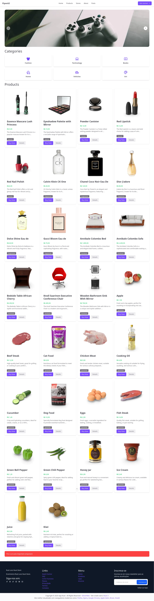

# App Loco Framework Web Rust with Nuxt
## App build with Rust Lang and Nuxt.js. Api Rust with Loco.rs and frontend with nuxt.js using vue.js.

### [Loco.rs](https://loco.rs/) It’s Like [Ruby on Rails](https://rubyonrails.org/), but for [Rust Lang](https://www.rust-lang.org/). 

 

### Skill

- [Rust Lang](https://www.rust-lang.org/)
- [Loco - Rust](https://loco.rs/)
- [PostgreSQL](https://www.postgresql.org/)
- [Vue.js](https://vuejs.org/)
- [Nuxt.js](https://nuxt.com/)
- [Tailwindcss](https://tailwindcss.com/)
- [Shadcn Vue](https://www.shadcn-vue.com/)
- [Daisy UI](https://daisyui.com/)
- [Flyon UI](https://flyonui.com/)

### Run app-loco

```shell
cd api_rust_loco/
cargo loco start
# run localhost:5150

```

### Run app-nuxt

```shell
cd app-nuxt/
pnpm dev --open
# run localhost:3000

```

### Docker and Docker Compose

```shell

docker-compose build
docker-compose up # run app-rust-loco http://localhost:5150 app-nuxt http://localhost:3000

docker-compose up --build # run app-rust-loco http://localhost:5150 app-nuxt http://localhost:3000

# Run diesel migration for create all tables migrations on database
docker-compose run --rm app cargo loco db migrate # Or

docker-compose run --rm app /bin/bash
cargo loco db migrate

# Run db:seed For populate data faker on database
docker-compose run --rm app cargo loco db seed # Or

docker-compose run --rm app /bin/bash
cargo loco db seed

# App Loco Rust individual
docker-compose build app-rust-loco
docker-compose run --rm app-rust-loco
# run http://0.0.0.0:5150

# App Nuxt individual
docker-compose build app-nuxt
docker-compose run --rm app-nuxt
# run http://0.0.0.0:3000

# Optional
docker-compose ps
docker-compose stop
docker-compose down
docker-compose run --rm app bash
docker network create rustnet

# sudo docker rmi --force $(docker images -f "dangling=true" -q)

```


https://gilcierweb.com.br
